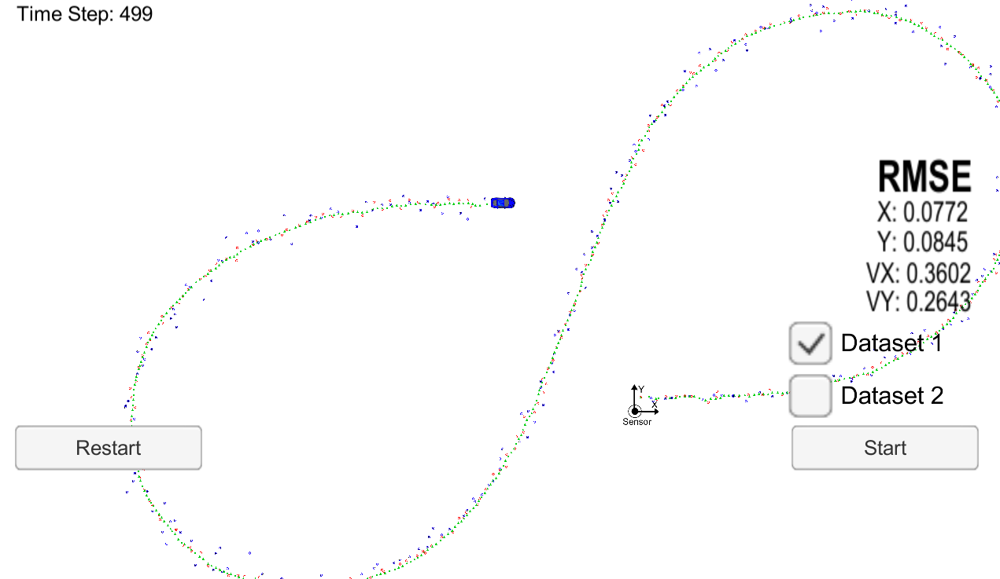

# Unscented Kalman Filter Project Starter Code
Self-Driving Car Engineer Nanodegree Program

## Objective
Utilize an Unscented Kalman Filter to estimate the state of a moving object of interest with noisy lidar and radar measurements.

## Deliverables
1. UKF algorithm that predicts object position to the current timestep and then updates the prediction using the sensor output;
2. UKF algorithm implemented with measurement functions for Lidar vs. radar, and calls the function according to the sensor type;
3. RMSE less than $[.09, .10, .40, .30]$ as shown in the figure below:
